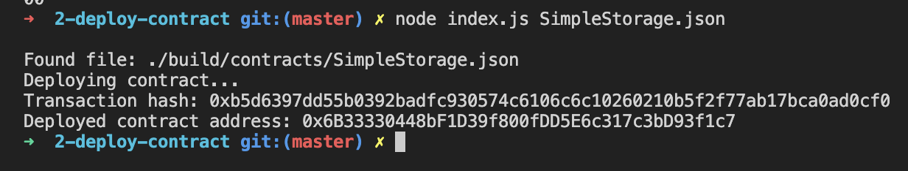

# Gitcoin: 1) Create A Godwoken Account On The EVM Layer 2 Testnet

1. A screenshot of the console output immediately after you have successfully deployed a smart contract.

2. The transaction hash from the contract deployment (in text format)
<b>0xb5d6397dd55b0392badfc930574c6106c6c10260210b5f2f77ab17bca0ad0cf0</b>

3. The deployed contract address from the contract deployment (in text format)..
<b>0x6B33330448bF1D39f800fDD5E6c317c3bD93f1c7</b>

