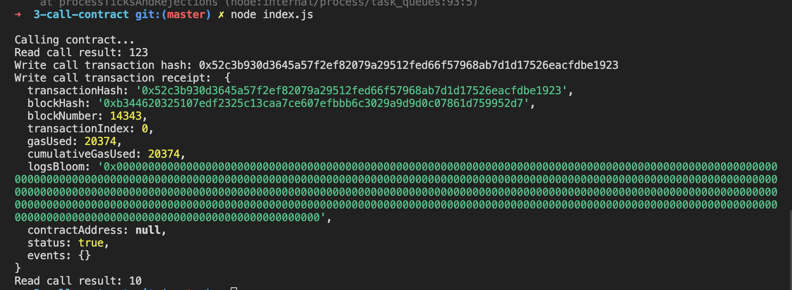

# Gitcoin: 2) Deploy A Simple Ethereum Smart Contract On Polyjuice

1. A screenshot of the console output immediately after you have successfully deployed a smart contract.

2. The transaction hash from the console output (in text format).
    
   <b>0x52c3b930d3645a57f2ef82079a29512fed66f57968ab7d1d17526eacfdbe1923</b>

3. The contract address that you called (in text format).
    
   <b>0x6B33330448bF1D39f800fDD5E6c317c3bD93f1c7</b>

4. The ABI for contract you made a call on (in text format).
    
   <b>
   [
   {
   "inputs": [],
   "stateMutability": "payable",
   "type": "constructor"
   },
   {
   "inputs": [
   {
   "internalType": "uint256",
   "name": "x",
   "type": "uint256"
   }
   ],
   "name": "set",
   "outputs": [],
   "stateMutability": "payable",
   "type": "function"
   },
   {
   "inputs": [],
   "name": "get",
   "outputs": [
   {
   "internalType": "uint256",
   "name": "",
   "type": "uint256"
   }
   ],
   "stateMutability": "view",
   "type": "function"
   }
   ]
   </b>
