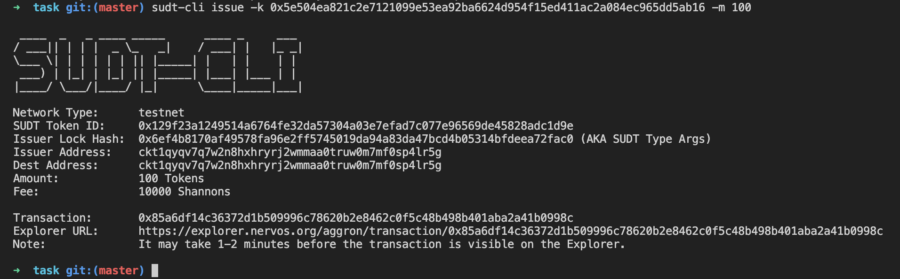

# Gitcoin: 4) Issue An SUDT Token On Layer 1 And Deposit It To Layer 2

1. A link to the Layer 1 address you funded on the Testnet Explorer.

**https://explorer.nervos.org/aggron/address/ckt1qyqv7q7w2n8hxhryrj2wmmaa0truw0m7mf0sp4lr5g**

2. A screenshot of the console output immediately after using sudt-cli to create your SUDT tokens on Layer 1.



3. A link to the transaction ID created by sudt-cli on the Testnet Explorer..

**https://explorer.nervos.org/aggron/transaction/0x85a6df14c36372d1b509996c78620b2e8462c0f5c48b498b401aba2a41b0998c**

3. A screenshot of the console output immediately after you have successfully submitted a deposit to Layer 2 using the account-cli tool.

[alt text](4.png)

5. The SUDT ID from the console output after executing the deposit script (in text format).

```
814
```
