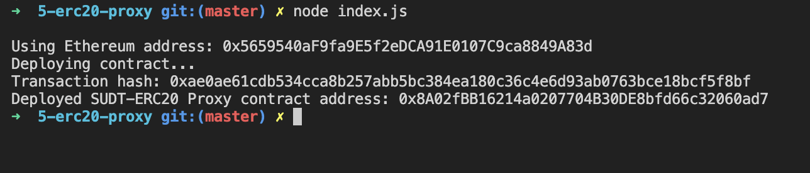
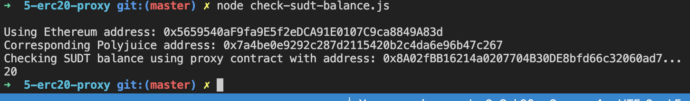

# Gitcoin: 5) Deploy The ERC20 Proxy Contract For The Deposited SUDT

1. A screenshot of the console output immediately after deploying smart contract.



2. The address of the ERC20 Proxy Contract you deployed (in text format).

```
0x8A02fBB16214a0207704B30DE8bfd66c32060ad7
```

3. A screenshot of the console output immediately after checking your SUDT balance



4. The Ethereum address that was checked (in text format).

```
0x5659540aF9fa9E5f2eDCA91E0107C9ca8849A83d
```
