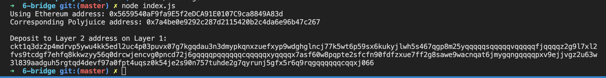

# Gitcoin: 6) Use Force Bridge To Deposit Tokens From Ethereum To Polyjuice

1. A screenshot of the console output immediately after you have successfully generated your Deposit Receiver Address.



2. Your Deposit Receiver Address (in text format).

```
ckt1q3dz2p4mdrvp5ywu4kk5edl2uc4p03puvx07g7kgqdau3n3dmypkqnxzuefxyp9wdghglncj77k5wt6p59sx6kukyjlwh5s467qgp8m25yqqqqqsqqqqqvqqqqqfjqqqqz2g9l7xl2fvs9tcdgf7ehfq8kkwzyy56q0drcwjencvg0pncd72j6gqqqqpqqqqqqcqqqqqxyqqqqx7asf60w8pqpte2sfcfn90fdfzxue7ff2g8sawe9wacnqat6jmygqngqqqqpxv9ejjvgz2u63w3l839aadguh5rgtqd4devf97a0fpt4uqsz0k54je2s90n757tuhde2g7qyrunj5gfx5r6q9rqgqqqqqqcqqxj066
```

3. The Ethereum address used to generate the Deposit Receiver Address (in text format).

```
0x5659540aF9fa9E5f2eDCA91E0107C9ca8849A83d
```

4. A link to the Etherscan explorer for the successful Force Bridge transaction.

**https://rinkeby.etherscan.io/tx/0xe0d4761d8da815446285d2eea70e64c40662e6112586a2ddd3f9ac7acdc94ef6**
5. A link to the Nervos explorer for the successful Force bridge transaction. 
**https://explorer.nervos.org/aggron/transaction/0x0030314223c5df7ebf7e0b6c8e0665edfbd0a2411d7b91e7afc8d6507be4e695**