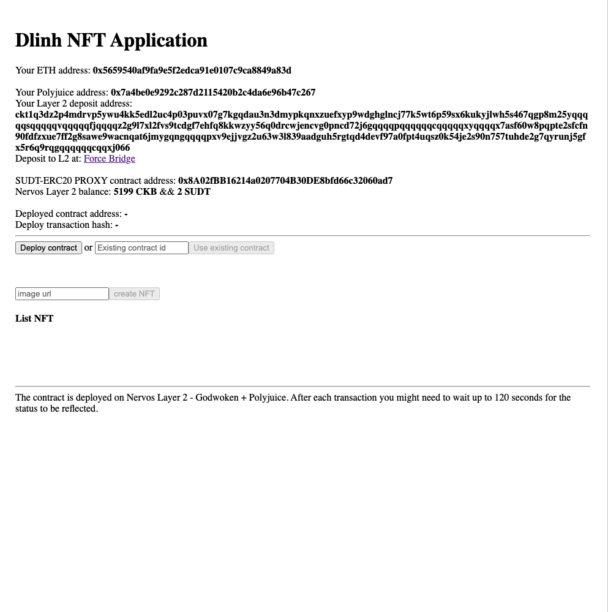

# Gitcoin: 6) Use Force Bridge To Deposit Tokens From Ethereum To Polyjuice

1. A screenshot of the console output immediately after you have successfully generated your Deposit Receiver Address.

2. The address of the SUDT-ERC20 Proxy Contract that you deployed (in text format).

`0x8A02fBB16214a0207704B30DE8bfd66c32060ad7`

3. A link to the GitHub repository with your EVM application that integrates Force Bridge support.

**https://github.com/duylinh196tb/Nervos_7/tree/task-8**