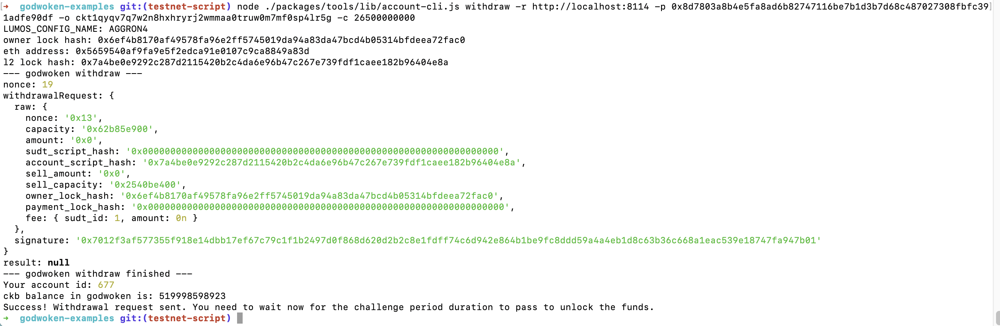

# Gitcoin: 9) Initiate Withdrawal Process From The Layer 2 Back To Layer 1

1. A screenshot of the console output immediately after running the withdraw command.

2. The Ethereum address that you've used for your Layer 2 account (in text format).

`0x5659540aF9fa9E5f2eDCA91E0107C9ca8849A83d`

3. The Nervos Layer 1 address that you passed to withdraw command (in text format).

`ckt1qyqv7q7w2n8hxhryrj2wmmaa0truw0m7mf0sp4lr5g`
